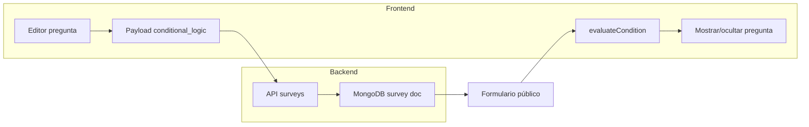

# Plan de crecimiento – Survey App

*Plan guardado para aplicar más tarde. Cursor ya lo tiene en `.cursor/plans/`; esta copia queda en el repositorio.*

---

## Estado actual (resumen)

- **Backend**: Django + MongoDB; encuestas, respuestas, grupos, usuarios, sync y endpoints públicos. Lógica condicional ya soportada en el modelo (serializers y vistas).
- **Frontend**: Un solo archivo `frontend/survey-ui/src/App.jsx` (~4.300 líneas). La evaluación de `conditional_logic` ya existe (`evaluateCondition`), pero **no hay UI para configurarla** al editar una pregunta (solo se puede enviar por API o scripts).
- **Duplicar encuesta**: Solo vía scripts (`create_ronda_diaria_th_survey.py`, `create_clinica_maicao_survey.py`); no existe en la interfaz.

---

## Fase 1 – Producto (valor inmediato)

### 1.1 UI para configurar lógica condicional

- **Objetivo**: En el editor de encuesta, al seleccionar una pregunta, poder activar "Mostrar solo si…" y elegir: pregunta de referencia, operador (`equals`, `not_equals`, `contains`, `greater_than`, etc.) y valor.
- **Dónde**: En el panel de edición de pregunta dentro de `App.jsx` (zona donde ya se editan `question_text`, `question_type`, `required`, `section_id`).
- **Implementación**:
  - Añadir estado/UI para "Usar lógica condicional" (checkbox o toggle).
  - Si está activo: selector de pregunta (lista de `surveyData.questions` con id/texto), selector de operador (dropdown con los que ya usa `evaluateCondition`), y campo de valor (texto/número según tipo de pregunta).
  - Al guardar la pregunta, asignar `conditional_logic: { type: 'show_if', question_id, operator, value }` (o `null` si se desactiva). El payload ya se envía en `handleSaveSurvey` con `conditional_logic: q.conditional_logic || null`.
- **Referencia**: Operadores ya implementados en `evaluateCondition` (líneas ~572–600 en App.jsx); `FEATURES_SECTIONS.md` documenta la estructura.

### 1.2 Duplicar encuesta desde la UI

- **Objetivo**: Botón "Duplicar" en la lista o detalle de encuesta que cree una copia (mismo título + " (copia)", mismas secciones y preguntas, sin respuestas).
- **Backend**: Añadir endpoint opcional `POST /api/surveys/{id}/duplicate/` que, con el token del usuario, lea la encuesta, quite `_id` y `is_deleted`, cambie `title` y cree un nuevo documento; o hacerlo en frontend con GET del survey y `POST /api/surveys/` con el payload modificado.
- **Frontend**: En la vista de listado/acciones de encuesta, botón "Duplicar" que llame al nuevo endpoint o que haga GET + POST con `title: survey.title + ' (copia)'`, `questions`, `sections` y sin `id`/respuestas.

---

## Fase 2 – Estructura del código (mantenibilidad)

### 2.1 Modularizar el frontend

- **Objetivo**: Reducir el tamaño de `App.jsx` y mejorar navegación y reutilización.
- **Pasos**:
  - Extraer componentes por pantalla o bloque: por ejemplo `Dashboard`, `SurveyList`, `SurveyEditor` (editor de encuesta), `QuestionEditor` (fila/panel de pregunta), `PublicSurveyForm` (formulario público), `ResponseStats`/gráficos, `UserManagement`, etc.
  - Introducir **React Router** (o similar) para rutas: `/`, `/surveys`, `/surveys/:id/edit`, `/surveys/:id/responses`, `/public/survey/:id`, `/users` (si aplica). El estado actual (`view`, `editingSurveyId`) puede coexistir y luego migrarse a rutas.
  - Extraer hooks: por ejemplo `useAuth`, `useSurveys`, `useSurvey(surveyId)` (fetch de una encuesta), lógica de export Excel.
- **Ubicación sugerida**: `src/components/`, `src/pages/`, `src/hooks/`; mantener `App.jsx` como shell que renderiza rutas y provee contexto si se usa.

### 2.2 Modularizar el backend (views)

- **Objetivo**: Dividir `backend/surveys/views.py` (muy grande) en módulos por dominio.
- **Pasos**:
  - Crear por ejemplo: `views_auth.py`, `views_survey_groups.py`, `views_surveys.py`, `views_responses.py`, `views_public.py`, `views_users.py`.
  - Mover cada clase de vista al módulo correspondiente e importar en `views/__init__.py` o en `urls.py` desde los nuevos módulos.
  - No cambiar URLs ni comportamiento; solo reorganizar código.

---

## Fase 3 – Calidad y operación (opcional)

### 3.1 Tests

- **Backend**: Tests de API (Django REST) para: login, listar/crear encuesta, obtener encuesta pública, crear respuesta pública, permisos por rol (root vs encuestador), duplicate si se implementa.
- **Frontend**: Tests de componentes críticos (por ejemplo: render de pregunta con `conditional_logic`, envío de respuesta) una vez extraídos a componentes.

### 3.2 Limpieza y producción

- **Logs de depuración**: En `backend/surveys/serializers.py`, `CustomTokenObtainPairSerializer` escribe en `.cursor/debug.log`. Quitar esos bloques o condicionarlos a `DEBUG`/variable de entorno para producción.

### 3.3 Mejoras de producto (según necesidad)

- **Fechas de vigencia**: Campos `date_open` / `date_close` en encuesta; en `PublicSurveyView` y al listar, no permitir responder o no mostrar si no está en vigencia.
- **Lógica por sección**: Extender el modelo para que una sección pueda tener `conditional_logic` y en frontend mostrar/ocultar bloques enteros según respuestas (reutilizando `evaluateCondition`).

---

## Orden sugerido de ejecución

1. **Fase 1.1** – UI lógica condicional (alto impacto, ámbito acotado en App.jsx).
2. **Fase 1.2** – Duplicar encuesta (backend opcional + botón y flujo en frontend).
3. **Fase 2.1** – Modularizar frontend (mejor base para seguir añadiendo features).
4. **Fase 2.2** – Modularizar views (mantenimiento backend).
5. **Fase 3** – Según prioridad: tests, limpieza de logs, fechas de vigencia o lógica por sección.

---

## Diagrama de dependencias (flujo actual de lógica condicional)

Hoy `Payload` se rellena por API/scripts; la Fase 1.1 añade la UI en `Editor` para que el usuario configure `conditional_logic` y se guarde en `Payload`.
